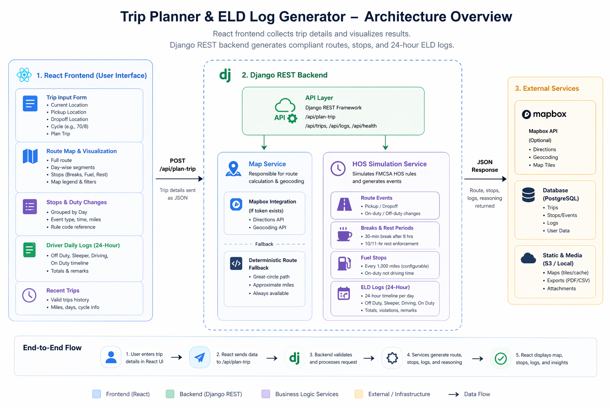

# FMCSA Trip Planner and ELD Log Generator

Production-style full-stack assessment project for planning a truck route and generating FMCSA Hours of Service duty logs.

---

## 🔗 Live Links

* Frontend: <your-vercel-link>
* Backend API: <your-render-link>
* Loom Demo: <your-loom-link>

---

## What It Does

* Accepts current, pickup, and dropoff locations plus current 70-hour cycle usage.
* Builds a route using Mapbox when configured, with a deterministic fallback route generator for local demos.
* Simulates FMCSA HOS rules:

  * 11-hour driving limit
  * 14-hour duty window
  * 30-minute break after 8 hours of driving
  * 70-hour / 8-day cycle limit
  * 10-hour reset between driving days
* Generates structured daily ELD logs with Off Duty, Sleeper Berth, Driving, and On Duty statuses.
* Enforces legal boundaries by blocking driving when limits are reached.
* Returns a compliance summary with validation checks, warnings, violations, and remaining cycle hours.
* Visualizes route, stops, and log-sheet timelines in React.
* Includes map legend, labeled stop markers, route auto-fit, reset view, hover highlighting, and per-day route focus.
* Saves planned trips to SQLite and displays recent trip history.

---

## Architecture Overview

The backend owns compliance-sensitive logic. React gathers input, renders results, and visualizes map/log data.

```text
React UI -> POST /api/plan-trip -> Django REST Framework
                                      |-- Map service
                                      |   |-- Mapbox route/geocode if token exists
                                      |   `-- deterministic fallback route generator
                                      `-- HOS simulation service
                                          |-- route events
                                          |-- rest/fuel stops
                                          `-- 24-hour ELD logs
```

---


## Folder Structure

```text
fmcsa-trip-planner/
  backend/
    manage.py
    requirements.txt
    .env.example
    config/
      settings.py
      urls.py
      wsgi.py
      asgi.py
    trip_planner/
      models.py
      serializers.py
      urls.py
      views.py
      migrations/
      services/
        hos.py
        map_service.py
      tests/
        test_hos.py
  frontend/
    package.json
    index.html
    vite.config.js
    .env.example
    src/
      App.jsx
      main.jsx
      styles.css
      components/
        CompliancePanel.jsx
        DecisionTrace.jsx
        TripHistory.jsx
        LogSheet.jsx
        MapView.jsx
        StopList.jsx
        TripForm.jsx
      services/
        api.js
```

---

## Backend Setup

```bash
cd backend
python -m venv .venv
.venv\Scripts\activate
pip install -r requirements.txt
copy .env.example .env
python manage.py migrate
python manage.py runserver
```

### Optional Mapbox Support

```bash
MAPBOX_ACCESS_TOKEN=your_token_here
```

---

## Routing Behavior

The system integrates with Mapbox for real-world routing when a `MAPBOX_ACCESS_TOKEN` is provided.

If no token is configured, a deterministic fallback route generator is used. This ensures the application remains fully functional for evaluation without requiring external API keys.

---

## Frontend Setup

```bash
cd frontend
npm install
copy .env.example .env
npm run dev
```

Open: http://localhost:5173

---

## API

### POST `/api/plan-trip`

### Helper Endpoints

* `GET /` → API index
* `GET /api/demo-trip` → sample trip
* `GET /api/trips` → recent trips

---

### Example Request

```json
{
  "current_location": "Chicago, IL",
  "pickup_location": "St. Louis, MO",
  "dropoff_location": "Dallas, TX",
  "current_cycle_hours": 18
}
```

---

### Example Response

```json
{
  "route": {
    "distance_miles": 928.4,
    "duration_hours": 15.47,
    "path": [[41.8781, -87.6298], [38.627, -90.1994], [32.7767, -96.797]]
  },
  "stops": [
    {"type": "pickup", "label": "Pickup", "rule_code": "ON_DUTY_PICKUP"},
    {"type": "break", "label": "30-minute break", "rule_code": "HOS_30_MIN_BREAK"},
    {"type": "rest", "label": "10-hour rest", "rule_code": "HOS_10_HOUR_REST"},
    {"type": "dropoff", "label": "Dropoff", "rule_code": "ON_DUTY_DROPOFF"}
  ],
  "logs": [
    {
      "day": 1,
      "date": "2026-04-24",
      "segments": [
        {"status": "ON_DUTY", "label": "On Duty (not driving)", "start": 0, "end": 1, "remarks": "Pickup paperwork and loading"},
        {"status": "DRIVING", "label": "Driving", "start": 1, "end": 9, "remarks": "Driving segment"},
        {"status": "OFF_DUTY", "label": "Off Duty", "start": 9, "end": 9.5, "remarks": "Required 30-minute break"}
      ],
      "totals": {
        "OFF_DUTY": 0.5,
        "SLEEPER_BERTH": 10,
        "DRIVING": 11,
        "ON_DUTY": 1
      }
    }
  ],
  "compliance": {
    "status": "VALID",
    "is_compliant": true,
    "remaining_cycle_hours": 34.53,
    "violations": [],
    "warnings": []
  }
}
```

---

## Deployment

### Backend (Render)

1. Push repository to GitHub
2. Create Render Web Service (`backend` folder)
3. Build:

```bash
pip install -r requirements.txt
```

4. Start:

```bash
gunicorn config.wsgi:application
```

5. Environment Variables:

* `DJANGO_SECRET_KEY`
* `DJANGO_DEBUG=False`
* `ALLOWED_HOSTS`
* `CORS_ALLOWED_ORIGINS`
* `MAPBOX_ACCESS_TOKEN` (optional)

---

### Frontend (Vercel)

1. Import GitHub repo
2. Root directory: `frontend`
3. Build: `npm run build`
4. Output: `dist`

Environment variable:

```
VITE_API_BASE_URL=https://your-render-service.onrender.com/api
```

---

## Loom Demo Flow (3–5 minutes)

1. Problem: HOS-compliant trip planning
2. Enter trip → Plan
3. Show compliance summary
4. Show map + filters
5. Show stops + reasoning engine
6. Show daily logs
7. Show code (hos.py)
8. Mention deployment + Mapbox fallback

---

## Suggestions for Improvement

* Replace generated stop coordinates with true route interpolation
* Add PostgreSQL for persistence
* Add PDF export for log sheets
* Add authentication (driver/carrier profiles)
* Support split sleeper berth rules
* Add geocoding confidence warnings

---
